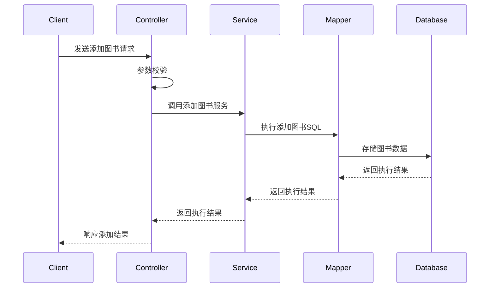
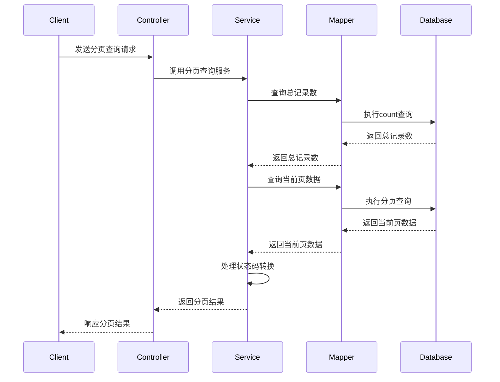

# 图书管理系统文档

## 项目概述

本项目是一个基于Spring Boot的图书管理系统，采用了现代Java开发技术栈，包括Spring Boot、MyBatis、MySQL等组件。系统提供了图书的增加、删除、修改、查询等基本功能，支持分页查询，并实现了用户管理的基础功能。


## 技术栈

- **后端框架**：Spring Boot 3.4.4
- **ORM框架**：MyBatis 3.0.4
- **数据库**：MySQL
- **项目管理**：Maven
- **其他工具**：Lombok（简化代码）

## 系统功能

### 核心功能

1. **图书管理**
   - 添加图书
   - 修改图书信息
   - 删除图书（单本删除和批量删除）
   - 查询图书信息
   - 分页展示图书列表

2. **用户管理**
   - 用户信息管理

## 项目结构

```
src/
├── main/
│   ├── java/
│   │   └── org/
│   │       └── example/
│   │           └── jd20250417springbookdemo/
│   │               ├── config/         # 配置类
│   │               ├── constant/       # 常量定义
│   │               ├── controller/     # 控制器层
│   │               ├── dao/            # 数据访问对象
│   │               ├── enums/          # 枚举类
│   │               ├── mapper/         # MyBatis映射接口
│   │               ├── model/          # 数据模型
│   │               ├── service/        # 服务层
│   │               └── Jd20250417SpringbookDemoApplication.java # 应用入口
│   └── resources/
│       ├── mapper/         # MyBatis XML映射文件
│       ├── static/         # 静态资源
│       ├── templates/      # 模板文件
│       └── application.yml # 应用配置文件
└── test/                  # 测试代码
```

## 数据模型

### 图书信息(BookInfo)

图书信息是系统的核心数据模型，用于存储图书的基本信息。

```java
@Data
public class BookInfo {
    private Integer id;          // 图书ID
    private String bookName;     // 书名
    private String author;       // 作者
    private Integer count;       // 数量
    private BigDecimal price;    // 价格
    private String publish;      // 出版社
    private Integer status;      // 状态：0-删除 1-正常 2-不可借阅
    private String statusCN;     // 状态中文描述
    private Date createTime;     // 创建时间
    private Date updateTime;     // 更新时间
}
```

### 用户信息(UserInfo)

用户信息模型用于存储系统用户的基本信息。

```java
@Data
public class UserInfo {
    private Integer id;        // 用户ID
    private String username;   // 用户名
    private String password;   // 密码
    private String nickname;   // 昵称
    private Date createTime;   // 创建时间
    private Date updateTime;   // 更新时间
}
```

## API接口设计

### 图书管理接口

#### 1. 添加图书

- **URL**: `/book/addBook`
- **方法**: POST
- **请求体**:
  ```json
  {
    "bookName": "图书名称",
    "author": "作者",
    "count": 10,
    "price": 29.99,
    "publish": "出版社",
    "status": 1
  }
  ```
- **响应**:
  ```json
  {
    "code": 0,
    "msg": "success",
    "data": 图书ID
  }
  ```

#### 2. 分页查询图书

- **URL**: `/book/getListByPage`
- **方法**: GET
- **参数**:
  - `pageNum`: 页码（从1开始）
  - `pageSize`: 每页数量
- **响应**:
  ```json
  {
    "code": 0,
    "msg": "success",
    "data": {
      "total": 总数量,
      "records": [
        {
          "id": 1,
          "bookName": "图书1",
          "author": "作者1",
          "count": 20,
          "price": 24.50,
          "publish": "出版社1",
          "status": 1,
          "statusCN": "正常",
          "createTime": "2025-04-17 21:10:00",
          "updateTime": "2025-04-17 21:10:00"
        }
        // 更多图书...
      ],
      "pageNum": 当前页码,
      "pageSize": 每页大小
    }
  }
  ```

#### 3. 查询图书详情

- **URL**: `/book/queryBookById`
- **方法**: GET
- **参数**:
  - `bookId`: 图书ID
- **响应**:
  ```json
  {
    "code": 0,
    "msg": "success",
    "data": {
      "id": 1,
      "bookName": "图书1",
      "author": "作者1",
      "count": 20,
      "price": 24.50,
      "publish": "出版社1",
      "status": 1,
      "statusCN": "正常",
      "createTime": "2025-04-17 21:10:00",
      "updateTime": "2025-04-17 21:10:00"
    }
  }
  ```

#### 4. 更新图书

- **URL**: `/book/updateBook`
- **方法**: POST
- **请求体**:
  ```json
  {
    "id": 1,
    "bookName": "新图书名称",
    "author": "新作者",
    "count": 15,
    "price": 39.99,
    "publish": "新出版社",
    "status": 1
  }
  ```
- **响应**:
  ```json
  {
    "code": 0,
    "msg": "success",
    "data": ""
  }
  ```

#### 5. 删除图书

- **URL**: `/book/deleteBook`
- **方法**: POST
- **参数**:
  - `bookId`: 图书ID
- **响应**:
  ```json
  {
    "code": 0,
    "msg": "success",
    "data": ""
  }
  ```

#### 6. 批量删除图书

- **URL**: `/book/batchDelete`
- **方法**: POST
- **参数**:
  - `ids`: 图书ID列表，例如：`ids=1&ids=2&ids=3`
- **响应**:
  ```json
  {
    "code": 0,
    "msg": "success",
    "data": true
  }
  ```

## 核心代码详解

### 1. 控制器层(Controller)

控制器负责处理HTTP请求，调用服务层处理业务逻辑，并返回响应结果。

#### BookInfoController.java

```java
@Slf4j
@RequestMapping("/book")
@RestController
public class BookInfoController {
    @Autowired
    private BookInfoService bookInfoService;

    // 添加图书
    @PostMapping(value = "/addBook", produces = "application/json")
    public Result addBook(@RequestBody BookInfo bookInfo) {
        log.info("添加图书，request: {}", bookInfo);
        // 参数校验
        if (!StringUtils.hasLength(bookInfo.getBookName())
                || !StringUtils.hasLength(bookInfo.getAuthor())
                || bookInfo.getCount() == null
                || bookInfo.getPrice() == null
                || !StringUtils.hasLength(bookInfo.getPublish())
                || bookInfo.getStatus() == null) {
            // 提供具体错误信息...
            return Result.fail("参数不合法");
        }
        try {
            bookInfoService.addBook(bookInfo);
            return Result.success(bookInfo.getId());
        } catch (Exception e) {
            log.error("添加图书异常, e: {}", e);
            return Result.fail("添加图书发生异常: " + e.getMessage());
        }
    }
    
    // 更多方法...
}
```

### 2. 服务层(Service)

服务层负责业务逻辑处理，调用数据访问层操作数据库。

#### BookInfoService.java

```java
@Service
public class BookInfoService {
    @Autowired
    private BookInfoMapper bookInfoMapper;

    // 添加图书
    public void addBook(BookInfo bookInfo) {
        bookInfoMapper.addBook(bookInfo);
    }

    // 分页查询
    public ResponseResult<BookInfo> getListByPage(PageRequest pageRequest) {
        // 获取总记录数
        Integer count = bookInfoMapper.count();

        // 获取当前页面的数据
        List<BookInfo> bookInfos = bookInfoMapper.selectBooksByPage(pageRequest);
        
        // 处理状态码转换为中文描述
        for (BookInfo bookInfo : bookInfos) {
            bookInfo.setStatusCN(BookStatusEnum.getStatusByCode(bookInfo.getStatus()).getDesc());
        }
        
        // 返回分页结果
        return new ResponseResult<>(count, bookInfos, pageRequest);
    }
    
    // 更多方法...
}
```

### 3. 数据访问层(Mapper)

数据访问层负责与数据库交互，执行SQL操作。

#### BookInfoMapper.java

```java
@Mapper
public interface BookInfoMapper {
    // 添加图书
    @Insert("INSERT INTO book_info " +
            "(id, book_name, author, count, price, publish, `status`)" +
            "VALUES " +
            " (#{id}, #{bookName}, #{author}, #{count}, #{price}, #{publish}, #{status})")
    Integer addBook(BookInfo bookInfo);

    // 分页查询
    @Select("SELECT * FROM book_info WHERE `status` <> 0 LIMIT #{offset}, #{pageSize}")
    List<BookInfo> selectBooksByPage(PageRequest pageRequest);

    // 获取总记录数
    @Select("SELECT COUNT(1) FROM book_info WHERE `status` <> 0")
    Integer count();
    
    // 更多方法...
}
```

### 4. XML映射文件

某些复杂的SQL操作通过XML映射文件实现，如动态SQL。

#### BookInfoMapper.xml

```xml
<mapper namespace="org.example.jd20250417springbookdemo.mapper.BookInfoMapper">
    <!-- 更新图书 -->
    <update id="updateBook">
        UPDATE book_info
        <set>
            <if test="bookName!=null">
                book_name = #{bookName},
            </if>
            <if test="author!=null">
                author = #{author},
            </if>
            <!-- 更多字段 -->
        </set>
        WHERE id = #{id}
    </update>

    <!-- 批量删除 -->
    <delete id="batchDelete">
        UPDATE book_info set status = 0 WHERE id IN
        <foreach collection="list" open="(" close=")" separator="," item="id">
            #{id}
        </foreach>
    </delete>
</mapper>
```

## 数据库设计

### 图书信息表(book_info)

| 字段名      | 类型          | 说明               | 备注                      |
|------------|--------------|-------------------|--------------------------|
| id         | INT          | 主键ID             | 自增                      |
| book_name  | VARCHAR(255) | 图书名称           |                          |
| author     | VARCHAR(100) | 作者              |                          |
| count      | INT          | 数量              |                          |
| price      | DECIMAL(10,2)| 价格              |                          |
| publish    | VARCHAR(100) | 出版社            |                          |
| status     | TINYINT      | 状态              | 0-删除 1-正常 2-不可借阅   |
| create_time| DATETIME     | 创建时间           | 默认当前时间               |
| update_time| DATETIME     | 更新时间           | 更新时自动更新             |

### 用户信息表(user_info)

| 字段名      | 类型          | 说明               | 备注                      |
|------------|--------------|-------------------|--------------------------|
| id         | INT          | 主键ID             | 自增                      |
| username   | VARCHAR(50)  | 用户名             | 唯一                      |
| password   | VARCHAR(100) | 密码              |                          |
| nickname   | VARCHAR(50)  | 昵称              |                          |
| create_time| DATETIME     | 创建时间           | 默认当前时间               |
| update_time| DATETIME     | 更新时间           | 更新时自动更新             |

## 配置说明

### application.yml

```yaml
spring:
  application:
    name: JD20250417-springbook-demo
  datasource:
    url: jdbc:mysql://127.0.0.1:3306/book_test?characterEncoding=utf8&useSSL=false&allowPublicKeyRetrieval=true
    username: root
    password: 212409
    driver-class-name: com.mysql.cj.jdbc.Driver
mybatis:
  configuration:
    map-underscore-to-camel-case: true # 驼峰自动转换
    log-impl: org.apache.ibatis.logging.stdout.StdOutImpl # 打印 SQL 语句
  mapper-locations: classpath:mapper/*.xml 
logging:
  file:
    name: spring-book.log
```

## 枚举设计

### 图书状态枚举(BookStatusEnum)

图书状态枚举用于定义图书的不同状态，并提供状态码与描述之间的转换。

```java
public enum BookStatusEnum {
    DELETE(0, "删除"),
    NORMAL(1, "正常"),
    NOT_AVAILABLE(2, "不可借阅");

    private final Integer code;
    private final String desc;

    // 构造方法、getter和静态方法...
}
```

## 系统流程

### 添加图书流程



### 分页查询流程



## 部署说明

### 环境要求

- JDK 17或以上
- Maven 3.6或以上
- MySQL 8.0或以上

### 构建步骤

1. 克隆项目到本地
   ```
   git clone https://github.com/vasc-language/JD20250417-springbook-demo.git
   ```

2. 进入项目目录
   ```
   cd JD20250417-springbook-demo
   ```

3. 使用Maven构建项目
   ```
   mvn clean package
   ```

4. 运行应用
   ```
   java -jar target/JD20250417-springbook-demo-0.0.1-SNAPSHOT.jar
   ```

## 总结与展望

本图书管理系统实现了基本的图书CRUD功能和用户管理功能，采用了Spring Boot和MyBatis等主流技术栈，具有良好的扩展性和可维护性。

### 未来规划

1. 完善用户权限管理功能
2. 增加图书借阅和归还功能
3. 添加数据统计和分析功能
4. 优化前端界面，提供更好的用户体验
5. 增加日志记录和系统监控功能

## 参考资料

- [Spring Boot官方文档](https://spring.io/projects/spring-boot)
- [MyBatis官方文档](https://mybatis.org/mybatis-3/)
- [MySQL官方文档](https://dev.mysql.com/doc/) 